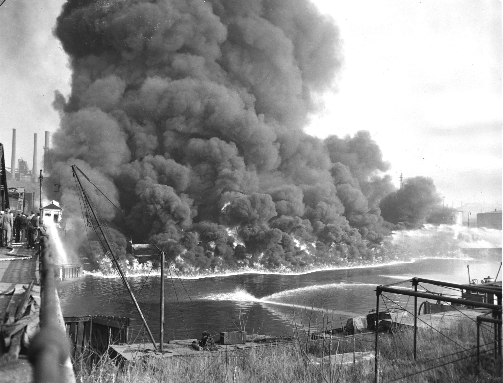
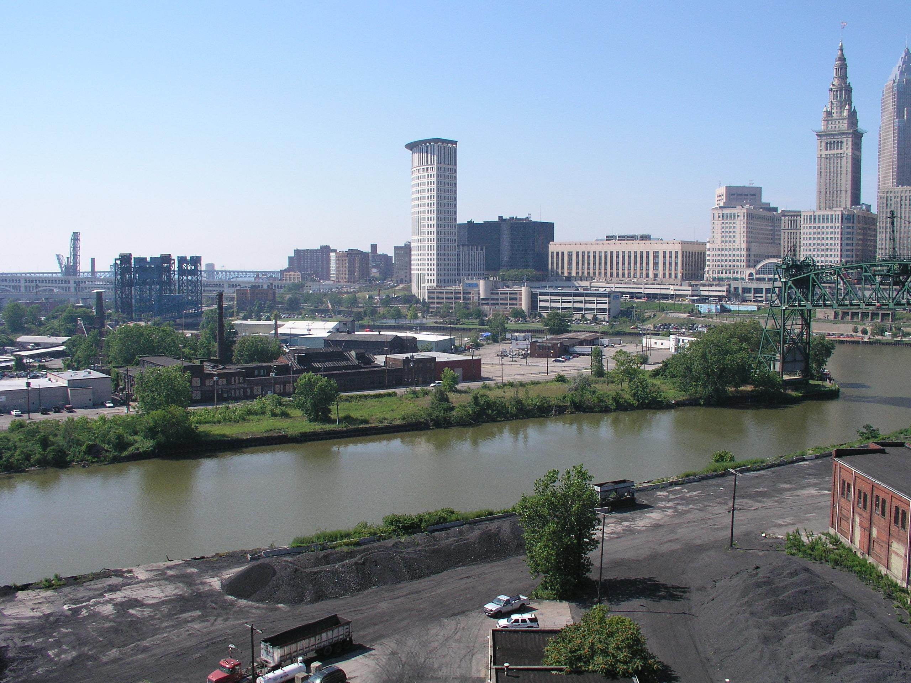
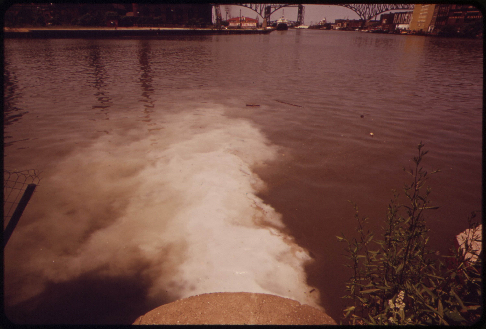
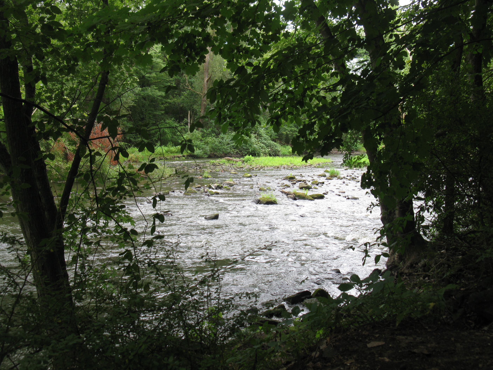
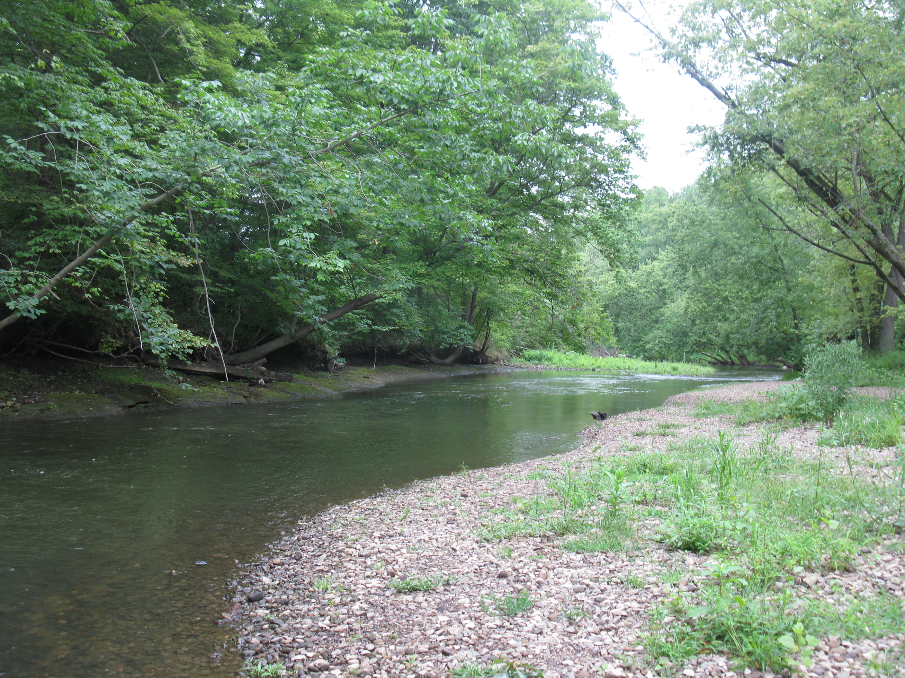
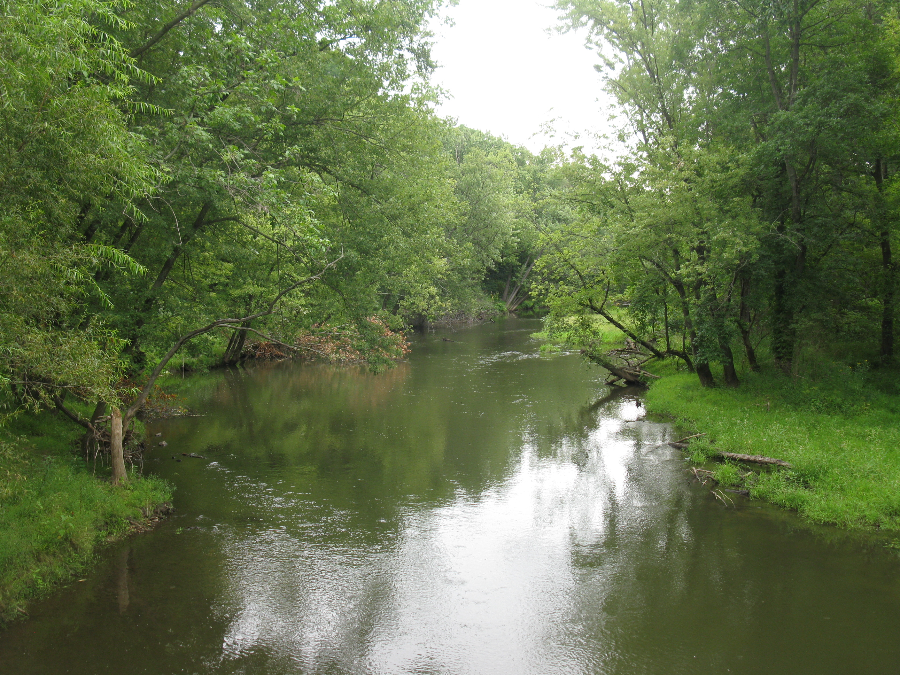

<style type="text/css">

body{ /* Normal  */
   font-size: 26px;
}
td {  /* Table  */
   font-size: 20px;
}
h1 { /* Header 1 */
 font-size: 38px;
 color: DarkBlue;
}
h2 { /* Header 2 */
 font-size: 32px;
 color: DarkBlue;
}
h3 { /* Header 3 */
 font-size: 28px;
 color: DarkBlue;
}
code.r{ /* Code block */
  font-size: 22px;
}
pre { /* Code block */
  font-size: 22px
}
</style>

-----

<br>
<br>
<br>
<br>
<br>


# Doom??

***[Global warming](https://www.nrdc.org/stories/global-warming-101), [runaway greenhouse effect](https://en.wikipedia.org/wiki/Runaway_greenhouse_effect), [rising sea levels](http://ocean.nationalgeographic.com/ocean/critical-issues-sea-level-rise/), [retreating glaciers](https://www.skepticalscience.com/himalayan-glaciers-growing.htm).***  We've all heard these terms.  The problem is real; the planet is warming due to an overabundance of greenhouse gases.  But is it inevitable?  Dire news like this might make us think it is.


<br>

-----

<br>

After all, have we, as a society, ever been able to collectively improve the environment?

<br>

-----

<br>

Headlines may make us think that we have not.  But we have made, and are continuing to make, significant environmental improvements on many fronts.  Here we will focus upon the unsung improvements in both measuring and reducing toxins in the environment.

<br>
<br>
<br>
<br>
<br>
<br>
<br>
<br>
<br>
<br>

-----

<br>
<br>
<br>

# Revisiting the Past

Let's take a moment to remember what things were like back in the 70's and 80s.

<div align="center">
   <iframe width="560" height="315" src="./visuals/joliet.mp4" frameborder="0" allowfullscreen>
   </iframe>
</div>

<br>
<br>
<br>

-----

<br>
<br>
<br>
<br>
<br>
<br>
<br>
<br>
<br>


-----

# But What About the Data?

Let's put our "data where our mouths are".  For this study, we'll specifically focus upon the [European Environment Agency's AirBase data](http://www.eea.europa.eu/themes/air/air-quality/map/airbase).

<br>

Similar data was discovered within Canada and the United States.


```{r sourceLibraries1, echo=FALSE, warning=FALSE, message=FALSE}
source('./Example_Presentation_lib.R')
```

```{r importData1, echo=FALSE, warning=FALSE, message=FALSE}
air_qual <- read_tsv('./data/AirBase_v6_statistics.csv')
air_qual_stations <- read_tsv('./data/AirBase_v6_stations.csv')
```

```{r chemsWithData1, echo=FALSE, warning=FALSE, message=FALSE}
## Here is a list of chemicals with a significant amount of data
chems_with_signif_data <- c(
  "Arsenic (aerosol)",
  "Benzene (air)",
  "Black smoke (air)",
  "Cadmium (aerosol)",
  "Carbon monoxide (air)",
  "Lead (aerosol)",
  "Nickel (aerosol)",
  "Nitrogen dioxide (air)",
  "Nitrogen monoxide (air)",
  "Nitrogen oxides (air)",
  "Ozone (air)",
  "Particulate matter < 10 µm (aerosol)",
  "Particulate matter < 2.5 µm (aerosol)",
  "Strong acidity (air)",
  "Sulphur dioxide (air)",
  "Toluene (air)",
  "Total suspended particulates (aerosol)"
)
```

```{r reduceDataSet1, echo=FALSE, warning=FALSE, message=FALSE}
## Here I will subset to those high data chemicals mentioned above
air_qual_df <- air_qual %>%
  filter(component_name %in% chems_with_signif_data)

## And merge the regional data
air_qual_df <- inner_join(air_qual_stations, air_qual_df)
air_qual_df$region <- tolower(air_qual_df$country_name)

## Fixing some of the "funny" names in the data set
for (country_name in country_fixes1) {
  air_qual_df[grepl(country_name, air_qual_df$region), "region"] <-
    country_name
}
for (country_name in country_fixes2) {
  air_qual_df[air_qual_df$region == country_name[1], "region"] <-
    country_name[2]
}
```


```{r focusOnKeyData1, echo=FALSE, warning=FALSE, message=FALSE}
chems_with_signif_imprv <- c(
  "Total suspended particulates (aerosol)",
  "Toluene (air)",
  "Nitrogen monoxide (air)",
  "Nitrogen dioxide (air)",
  "Benzene (air)",
  "Black smoke (air)",
  "Sulphur dioxide (air)",
  "Strong acidity (air)"
)
key_stats <- "50 percentile"
time_frames <- "day"

```

```{r firstPassData1, echo=FALSE, warning=FALSE, message=FALSE, results='asis'}
cat("<br>\n")
cat("<br>\n")
cat("\n\n---\n\n")
cat(paste0("First we'll study ", chems_with_signif_imprv[1], ":"))
cat("<br>\n")
cat("<br>\n")
for (key_chem in chems_with_signif_imprv) {
  for (key_stat in key_stats) {
    for (time_frame in time_frames) {
      cat("<br>\n")
      if (key_chem == chems_with_signif_imprv[length(chems_with_signif_imprv)]) {
        cat(paste0("Finally we'll cover ", key_chem, ":"))
      } else if (key_chem != chems_with_signif_imprv[1]) {
        cat(paste0("Next we'll look at ", key_chem, ":"))
      }
      cat("<br>\n")
      air_qual_subset <- air_qual_df %>%
        filter(component_name %in% key_chem &
                 statistic_name %in% key_stat &
                 statistics_average_group %in% time_frame) %>%
        group_by(statistics_year) %>%
        mutate(median_val = median(statistic_value))
      my_lims <- quantile(air_qual_subset$statistic_value,
                          probs = c(0,0.99))
      my_plt <- ggplot(air_qual_subset,
                       aes(factor(statistics_year,
                                  ordered = TRUE,
                                  levels = rev(sort(unique(
                                    statistics_year)))),
                           statistic_value)) +
        geom_boxplot(aes(fill=median_val)) +
        
        geom_label(data = summarize(air_qual_subset,
                                   med_value = median(statistic_value)) %>%
                    filter(statistics_year %in% years),
                  aes(x = factor(statistics_year, ordered = TRUE,
                                 levels=rev(sort(unique(statistics_year)))),
                      y = my_lims[2],
                      label = round(med_value,
                                    -ceiling(log10(med_value)) + 3)),
                  size = rel(4)) +
        labs(title = paste0(key_chem, ",\n",
                            "median levels measured")) +
        scale_fill_gradientn(colors = environ_clrs, guide = FALSE) + 
        scale_x_discrete("Year", breaks = years, labels = years) +
        scale_y_continuous(names(air_qual_subset$measurement_unit %>%
                                     table %>% sort %>% rev)[1]) +
        coord_flip(ylim = my_lims)
      print((theme_improve(my_plt)))
      cat("<br>\n")
      cat("\n\n---\n\n")
      cat("<br>\n")
      cat("<br>\n")
      cat("<br>\n")
      cat("<br>\n")
      cat("<br>\n")
    }
  }
}
```


While not every metric is improving as significantly, we are seeing improvement across many different unhealthy and environmentally dangerous chemicials.

<br>
<br>
<br>
<br>
<br>
<br>
<br>
<br>
<br>
<br>

-----

# Improvements in Measurement

Equally importantly, and not captured in the data above, there is significantly more ***data capture*** in recent times.


<br>
<br>
<br>
<br>
<br>
<br>
<br>
<br>
<br>
<br>
<br>
<br>
<br>
<br>
<br>
<br>
<br>
<br>

Many of the countries which began measuring later were countries that are less economically developed.

<br>

This suggests that an improved environment needn't be merely a "luxury" of the rich countries.


<br>
<br>
<br>
<br>
<br>

-----

# Looking Back Once Again

We began with some images of Joliet, IL.

<br>

Joliet was not alone, pollution was significantly worse a few generations ago, across the globe and within the US.

<br>

We'll come back to the US, to look at the scourge of the rust belt, the [Cuyahoga River](https://en.wikipedia.org/wiki/Cuyahoga_River), where the mouth ends in Cleveland.

<br>
<br>
<br>


The mouth of the Cuyahoga (Cleveland) then:



<br>
<br>

The mouth of the Cuyahoga (Cleveland) now:



<br>
<br>
<br>
<br>

Along the Cuyahoga (Cleveland) then:



<br>
<br>

Along the Cuyahoga (Cleveland) now:








