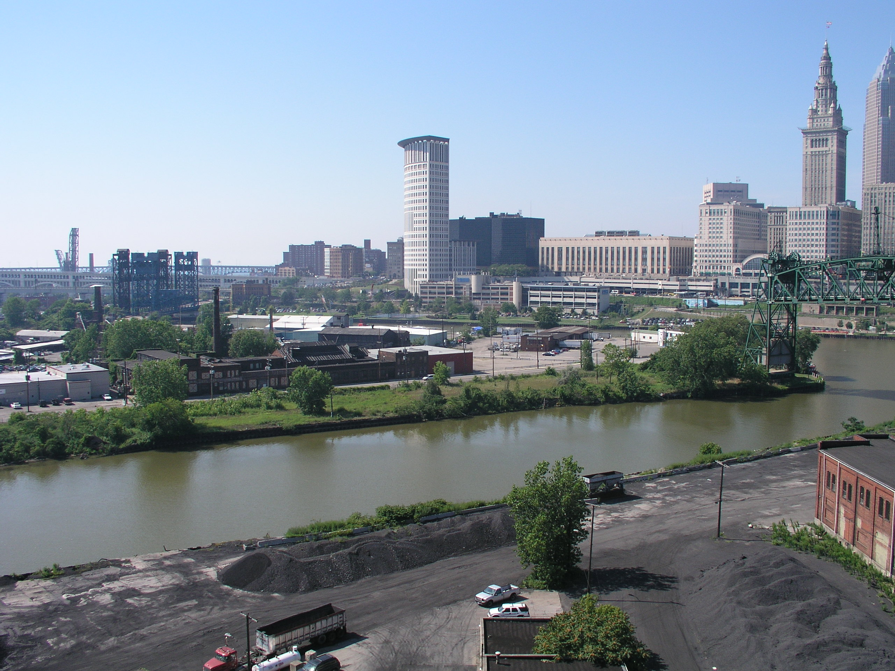

# runtime: shiny


<style type="text/css">

body{ /* Normal  */
   font-size: 14px;
}
td {  /* Table  */
   font-size: 20px;
}
h1 { /* Header 1 */
 font-size: 38px;
 color: DarkBlue;
}
h2 { /* Header 2 */
 font-size: 32px;
 color: DarkBlue;
}
h3 { /* Header 3 */
 font-size: 28px;
 color: DarkBlue;
}
code.r{ /* Code block */
  font-size: 22px;
}
pre { /* Code block */
  font-size: 22px
}
</style>

-----

<br>
<br>
<br>
<br>
<br>


# Environmental Concerns and Realities

There are many reports of *[Global warming](https://www.nrdc.org/stories/global-warming-101)*, for instance detailing approaching *[runaway greenhouse effects](https://en.wikipedia.org/wiki/Runaway_greenhouse_effect)*.  Reports on *[rising sea levels](http://ocean.nationalgeographic.com/ocean/critical-issues-sea-level-rise/)* and  *[retreating glaciers](https://www.skepticalscience.com/himalayan-glaciers-growing.htm)* are equally as abundant.  This report will not attempt to dispute any of these claims, nor the very real and significant dangers of human inaction.  Or, more precisely, the dangers of continuing upon our current course, where economic productivity and consumption lifestyles are in part responsible for the warming of our Earth and its atmosphere.

-----

However, this picture is often painted as if global warming, and more particularly, runaway greenhouse effects, are a *fait accompli*, as if human intervention cannot prevent these effects and we are doomed as a species and global civilization.  Or, at the least, that we, as a civilization, must reach into a collective global will, determination, and moral conviction the likes of which we have never before seen.

It is this point which is disputed in this report.  Humankind has collectively risen to successfully confront such challenges in the past, and continues to do so.  More specifically, we have risen to confront many forms of air pollution and environmental damage, improving our environment and air quality dramatically over the past few decades, across varied economies, and with further oversight.

<br>
<br>

-----

# Revisiting the Past

We have not successfully addressed the concerns of global warming at any point in the last few decades.  Why would the author suggest that humankind has successfully addressed the environment and air quality in the past?  A generation or two ago, discussions of pollution, and more specifically air pollution, was primarily concerned with [health and the introduction of harmful chemicals into the air](https://www.learner.org/courses/envsci/unit/pdfs/unit11.pdf).  In fact, while human-induced global warming was first proposed as possible [at the end of the 19th century](https://www.aip.org/history/climate/timeline.htm), even well into the 1970's, [significant cooling effects from aerosols](https://www.aip.org/history/climate/aerosol.htm#L_M031) were considered at least as significant.

Stepping back, the main takeaway is that there was a time in the recent past when **atmospheric pollution** did not only mean global warming, nor did it ***primarily*** refer to global warming.  The concerns a generation ago were on atmospheric particulates, acid rain, coal-induced soot, and unhealthy chemicals such as toluene infused in the air, harming our health and that of all forms of life on the planet.  Keep this older, non-global warming frame of mind, as we continue through this discussion.

In fact, let's take a moment to remember what things were like back in the 70's and 80s.  The video below opens with a scene from [Blues Brothers](http://www.imdb.com/title/tt0080455/), released in 1980.  This opening scene takes place in Joliet, IL.  Roughly one minute into the video, it cuts over to roughly the same area in Joliet in 2012, then finishes with a scene in the same location from 1980.

<div align="center">
   <iframe width="560" height="315" src="./visuals/joliet.mp4" frameborder="0" allowfullscreen>
   </iframe>
</div>

This landscape full of industrial smokestacks is emblematic of the [rust belt](http://www.encyclopedia.com/topic/Rust_Belt.aspx) of our recent past.

The photos of Joliet in 2012 show reinvigorated, blue sky.  The contrast could not be sharper.  In short, while the environment is by no means a "solved issue", we have proven our ability to address environmental issues.

<br>
<br>


-----

# Pollution Improves Across Many Metrics

This report will not focus upon the very important question of **how**:  how did we manage to collectively improve the environment so significantly over the last approximately 30 years?  Instead, it will provide a preponderance of quantitative data, supporting the great strides that the human race has made towards the qualitatively improved atmosphere that we now breath.

The earlier video and photos focused upon the rust belt.  We will now focus upon Europe, for the following reasons:

 - Providing another example, beyond the rust belt, yields further proof.
 - Europe represents a large population, **with dramatically different economies** between countries.
     - This point is important, since [arguments that an improved environment will necessarily hurt the economy](http://www.herinst.org/sbeder/envpolitics/pacific2.html#.Vwh7YhMrLdQ) are prevelant.  Whether or not there is truth in this claim, data here will show that developed and developing economies were both able to improve their environments during this period.
 - The [European Environment Agency's AirBase data set](http://www.eea.europa.eu/themes/air/air-quality/map/airbase) is well-organized and fairly exhaustive.

The curious reader can find similar data within Canada and the United States in the `data` file folder of this report.


```{r sourceLibraries1, echo=FALSE, warning=FALSE, message=FALSE}
source('./Example_Presentation_lib.R')
```

```{r importData1, echo=FALSE, warning=FALSE, message=FALSE}
air_qual <- read_tsv('./data/AirBase_v6_statistics.csv')
air_qual_stations <- read_tsv('./data/AirBase_v6_stations.csv')
```

```{r chemsWithData1, echo=FALSE, warning=FALSE, message=FALSE}
## Here is a list of chemicals with a significant amount of data
chems_with_signif_data <- c(
  "Arsenic (aerosol)",
  "Benzene (air)",
  "Black smoke (air)",
  "Cadmium (aerosol)",
  "Carbon monoxide (air)",
  "Lead (aerosol)",
  "Nickel (aerosol)",
  "Nitrogen dioxide (air)",
  "Nitrogen monoxide (air)",
  "Nitrogen oxides (air)",
  "Ozone (air)",
  "Particulate matter < 10 µm (aerosol)",
  "Particulate matter < 2.5 µm (aerosol)",
  "Strong acidity (air)",
  "Sulphur dioxide (air)",
  "Toluene (air)",
  "Total suspended particulates (aerosol)"
)
```

```{r reduceDataSet1, echo=FALSE, warning=FALSE, message=FALSE}
## Here I will subset to those high data chemicals mentioned above
air_qual_df <- air_qual %>%
  filter(component_name %in% chems_with_signif_data)

## And merge the regional data
air_qual_df <- inner_join(air_qual_stations, air_qual_df)
air_qual_df$region <- tolower(air_qual_df$country_name)

## Fixing some of the "funny" names in the data set
for (country_name in country_fixes1) {
  air_qual_df[grepl(country_name, air_qual_df$region), "region"] <-
    country_name
}
for (country_name in country_fixes2) {
  air_qual_df[air_qual_df$region == country_name[1], "region"] <-
    country_name[2]
}
```


```{r focusOnKeyData1, echo=FALSE, warning=FALSE, message=FALSE}
chems_with_signif_imprv <- c(
  "Total suspended particulates (aerosol)",
  "Toluene (air)",
  "Nitrogen monoxide (air)",
  "Nitrogen dioxide (air)",
  "Benzene (air)",
  "Black smoke (air)",
  "Sulphur dioxide (air)",
  "Strong acidity (air)"
)
key_stats <- "50 percentile"
time_frames <- "day"

```


```{r firstPassData1, echo=FALSE, warning=FALSE, message=FALSE, results='asis'}
my_plots = list()
for (key_chem in chems_with_signif_imprv) {
  for (key_stat in key_stats) {
    for (time_frame in time_frames) {
      air_qual_subset <- air_qual_df %>%
        filter(component_name %in% key_chem &
                 statistic_name %in% key_stat &
                 statistics_average_group %in% time_frame) %>%
        group_by(statistics_year) %>%
        mutate(median_val = median(statistic_value))
      my_lims <- quantile(air_qual_subset$statistic_value,
                          probs = c(0,0.99))
      my_plt <- ggplot(air_qual_subset,
                       aes(factor(statistics_year,
                                  ordered = TRUE,
                                  levels = rev(sort(unique(
                                    statistics_year)))),
                           statistic_value)) +
        geom_boxplot(aes(fill=median_val)) +
        geom_label(data = summarize(air_qual_subset,
                                   med_value = median(statistic_value)) %>%
                    filter(statistics_year %in% years),
                  aes(x = factor(statistics_year, ordered = TRUE,
                                 levels=rev(sort(unique(statistics_year)))),
                      y = my_lims[2],
#                      y = 10,
                      label = round(med_value,
                                    -ceiling(log10(med_value)) + 3)),
                  size = rel(4)) +
        labs(title = paste0(key_chem, ",\n",
                            "median levels measured")) +
        scale_fill_gradientn(colors = environ_clrs, guide = FALSE) + 
        scale_x_discrete("Year", breaks = years, labels = years) +
        scale_y_continuous(names(air_qual_subset$measurement_unit %>%
                                     table %>% sort %>% rev)[1]) +
        coord_flip(ylim = my_lims)
      my_plots[[key_chem]] <- theme_improve(my_plt)
    }
  }
}
```

<br>

-----

First, we'll look at the total level of suspended particulates, a measure of any solid particles suspended in the atmosphere.

```{r suspendedParticulates, echo=FALSE, warning=FALSE, message=FALSE, results='asis'}
print(my_plots[[chems_with_signif_imprv[1]]])
```

There are measuring stations located throughout several European cities.  For each year in the figure above, a boxplot is provided, capturing all of the measurements, in $\dfrac{\mu g}{m^3}$.  Also every 5 years the median value is highlighted.  We can see, for instance, a median level of 39 $\dfrac{\mu g}{m^3}$ in 1980 and 25 $\dfrac{\mu g}{m^3}$ in 2010.

These are notable gains, shifting from median levels consistently around 35 - 40 to levels consistently below 30.  However, particular toxins have seen far greater improvement.

<br>

-----

Next, we'll look at levels of [Toluene](https://en.wikipedia.org/wiki/Toluene), a known toxin, suspended in the air.

```{r toluene, echo=FALSE, warning=FALSE, message=FALSE, results='asis'}
print(my_plots[[chems_with_signif_imprv[2]]])
```

Here  we see even further improvement in the levels of toluene in the atmosphere.  We see a spike druing the late 1990's through the early 2000's.  This is primarily driven by additional testing, and testing in less economically developed countries.

We'll revisit this important idea again:  **we're seeing reductions in the amount of these toxins in the atmosphere, despite more measurements being made and in less economically developed countries**.  As mentioned earlier, there is a belief that improving the environment comes as a cost of economic growth.

<br>

-----

The following figures capture nitrogren monoxide, nitrogen dioxide, and benzene levels.  In all of these charts, we can see a consistent and dramatic decrease to half the original levels, or in some cases far better.


```{r NO, echo=FALSE, warning=FALSE, message=FALSE, results='asis'}
print(my_plots[[chems_with_signif_imprv[3]]])
```

```{r NO2, echo=FALSE, warning=FALSE, message=FALSE, results='asis'}
print(my_plots[[chems_with_signif_imprv[4]]])
```

There is one case in 1999 when we see the benzene levels spike.  This appeared to be due to a particular country, which we will see later.

```{r benzene, echo=FALSE, warning=FALSE, message=FALSE, results='asis'}
print(my_plots[[chems_with_signif_imprv[5]]])
```

<br>

-----

We'll close looking at black smoke, sulphur dioxide, and strong acidity.  Sulphur dioxide and the nitrogen oxides shown above are [primarily responsible for acid rain, and generated mostly from fossil fuel plants](https://www3.epa.gov/acidrain/education/site_students/whatcauses.html).


```{r blackSmoke, echo=FALSE, warning=FALSE, message=FALSE, results='asis'}
print(my_plots[[chems_with_signif_imprv[6]]])
```

```{r SO2, echo=FALSE, warning=FALSE, message=FALSE, results='asis'}
print(my_plots[[chems_with_signif_imprv[7]]])
```

```{r acidity, echo=FALSE, warning=FALSE, message=FALSE, results='asis'}
print(my_plots[[chems_with_signif_imprv[8]]])
```

In each of these cases, we see the 2010 median values dropping more than ***ten times*** from their values back in the 1970's.  The reductions were not modest; rather, ***dramatic reductions*** in the atmospheric levels of these harmful chemicals have been observed.

<br>

-----

# Pollution Metrics Improve over Time

The data above provide strong evidence that many pollution levels have improved over the years.  But, has the author ["cherry picked"](https://en.wikipedia.org/wiki/Cherry_picking) the data?  Has poor data been suppressed, either deliberately or accidentally?

First, all raw data can be found within the `./data` file path in this report.

However, accidental [bias in analysis](https://en.wikipedia.org/wiki/Bias_(statistics)) is always a significant concern.  The author delved into any issues with data bias.  Contrary to finding a bias which would paint the picture in an overly positive light, data collection procedures over the years of the study perhaps painted a picture which did not fully capture the dramatic levels of improvement that have occurred.

-----

More data across more environmental research stations was captured as time moved on.  More importantly, in terms of this report, as time progressed, less economically developed countries began measuring environmental pollution.  These less developed countries, as they jumped on board and began measurements, had pollution levels typically higher than their economically developed neighbors.  As time continued forward, these newly incorporated countries saw their pollution levels drop as well.

In other words, the box plots shown above were *spiked* with poorer data coming from higher polluting countries, and *still* dramatic reductions were achieved.

-----

Let's drill down on the data.  Here animated choropleth maps of Europe are generated, where each animation focuses upon a particular pollutant, capturing median measurements by country for each year of measurement.  Each title below is click-able, which will launch a choropleth map for the labelled pollutant.

<<insertHTML:[./SPM/animated_choropleth.html]

```{r, echo=FALSE}
htmltools::includeHTML("./SPM/animated_choropleth.html")
```

## [Total Suspended Particulates](./SPM/animated_choropleth.html)

In the case of total suspended particulates, we do not see a significant rise in countries that are capturing the metrics over the years.  However, with the countries that are capturing metrics, a general trend is still observed.

-----

## [Toluene](./C6H5-CH3/animated_choropleth.html)

Toluene shows a dramatic improvement both in the number of countries measuring toluene, and reduction of atmospheric toluene levels.  The same can be said for benzene and the nitrogen oxides; their improvements in measurement adoption are even more extreme.

-----

## [Nitrogen Monoxide](./NO/animated_choropleth.html)

-----

## [Nitrogen Dioxide](./NO2/animated_choropleth.html)

-----

## [Benzene](./C6H6/animated_choropleth.html)

-----

## [Black Smoke](./BS/animated_choropleth.html)

While black smoke saw significant improvements in the values that were measured, the adoption of the measurement of black smoke was not as wide spread as the nitrogen oxides or organics (benzene and toluene).

-----

## [Sulfur Dioxide](./SO2/animated_choropleth.html)

Sulfur dioxide saw the most dramatic improvement in measurement adoption, yielding full adoption across every country considered part of the European Environment agency.  Across all of these countries, vast reduction in the levels of sulfur dioxide was experienced.

-----

## [Strong Acidity](./SA/animated_choropleth.html)

Strong acidity saw significant improvements in the metrics, but never saw significant adoption across more than a handful of countries under the agency's purview.

-----

In most cases, as the years continue, more economically developed countries such as England and Germany, are joined by less economically developed countries such as Turkey or Portugal.  In nearly all cases, these newcomers' first pollutant measurements are higher than those of their more established counterparts, for that same year.

This also confirms what was implied earlier:  pollution levels can be reduced regardless of the economy's state of development.  This suggests that an improved environment needn't be merely a "luxury" of the rich countries.

Some of the lack of adoption in the metrics above may be due to the metrics themselves.  The reader will note that the metrics with less adoption rates include "strong acidity", "black smoke", and "total suspended particulates".  The first two are perhaps not sufficiently scientific, or at the least, considered effects, rather than causes, of air pollution.  Total suspended particulates is a [challenging substance to measure](http://www.tsi.com/uploadedFiles/_Site_Root/Products/Literature/Application_Notes/ITI-058.pdf).  These issues may contribute to their lack of adoption.  Whereas nitrogen oxides, sulphur dioxide, and organics are all known contributors to acid rain and air pollution, as mentioned earlier, and easier to measure and understand, in terms of root cause.


-----

# Some Perspective

Let's return to some images, reminding ourselves of the impact of this reduction in pollution levels.

This report began with some images of Joliet, IL.  Joliet was not alone, pollution was significantly worse a few generations ago, across the globe and within the US.

<br>

We'll come back to the US, to look at the scourge of the rust belt, the [Cuyahoga River](https://en.wikipedia.org/wiki/Cuyahoga_River), the mouth of which ends in Cleveland.

## Cuyahoga (Cleveland) ***Then***:

The river had actually caught on fire [many times since the late 19th century](https://www.washingtonpost.com/news/volokh-conspiracy/wp/2014/06/22/the-fable-of-the-burning-river-45-years-later/).  Below is one such incident, which occurred in 1952.


<br>

-----

## Cuyahoga (Cleveland) ***Now***:



The image above is from 2005.  Below is an aerial view of downtown Cleveland in 2012.  It is hard to imagine such a clear image with blue sky in the distance, had our disregard for the environment continued unabated during these 50 years.


# Closing Remarks

Our environment is perhaps more delicate than humankind had recognized two hundred years ago.  The United States and all the world's societies have a large task in front of us all, in addressing global warming, rising sea levels, and major environmental concerns now that we have recognized our entrance into the [anthropocene era](https://en.wikipedia.org/wiki/Anthropocene).

However, global warming is often discussed in Quixotic terms, as if we have inescapably and permanently entered an era of the ["new normal"](http://www.processphilosophy.org/no-turning-back-climate-change-as-the-new-normal.html).  The report reminds us that we ***have*** as a society, addressed concerns larger than ourselves in the past.  More specifically, we have successfully addressed **environmental concerns** in our recent past.  The challenges before us, as an economy, a society, and a global citizenry are non-trivial, to be sure.  But we can collectively overcome them.  This report provided a case study showing that we have addressed similar challenges in the past.  We have a case study of recent success, to act as inspiration for our future work, if not as a direct blueprint of actions to take in the future.


